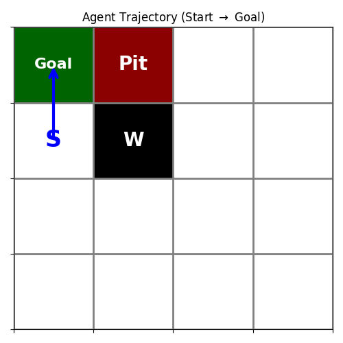
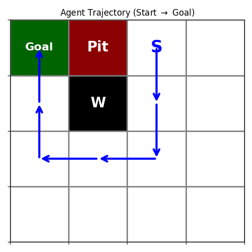
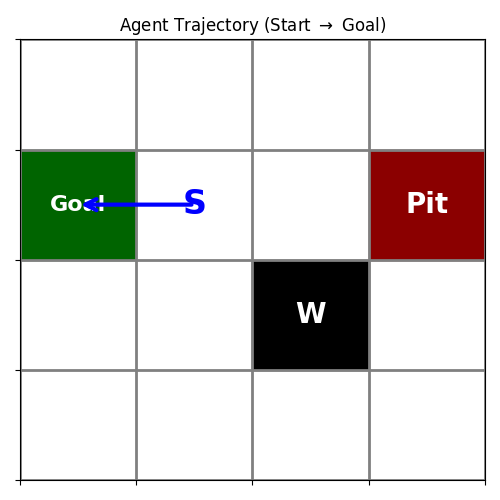
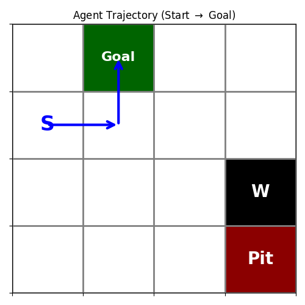
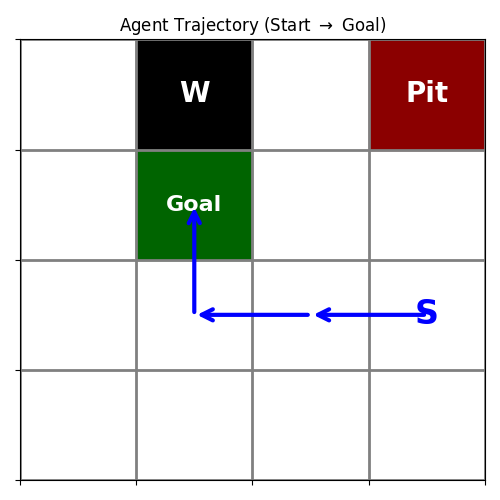
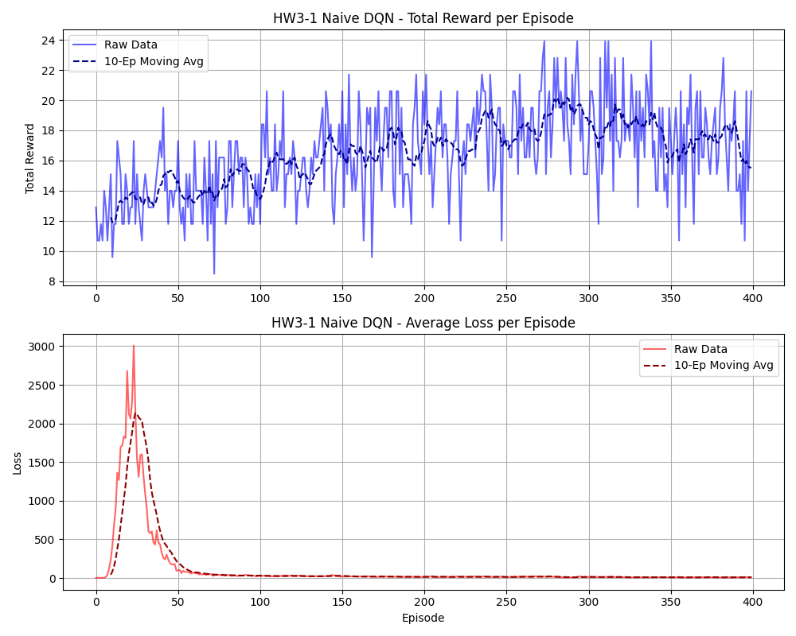
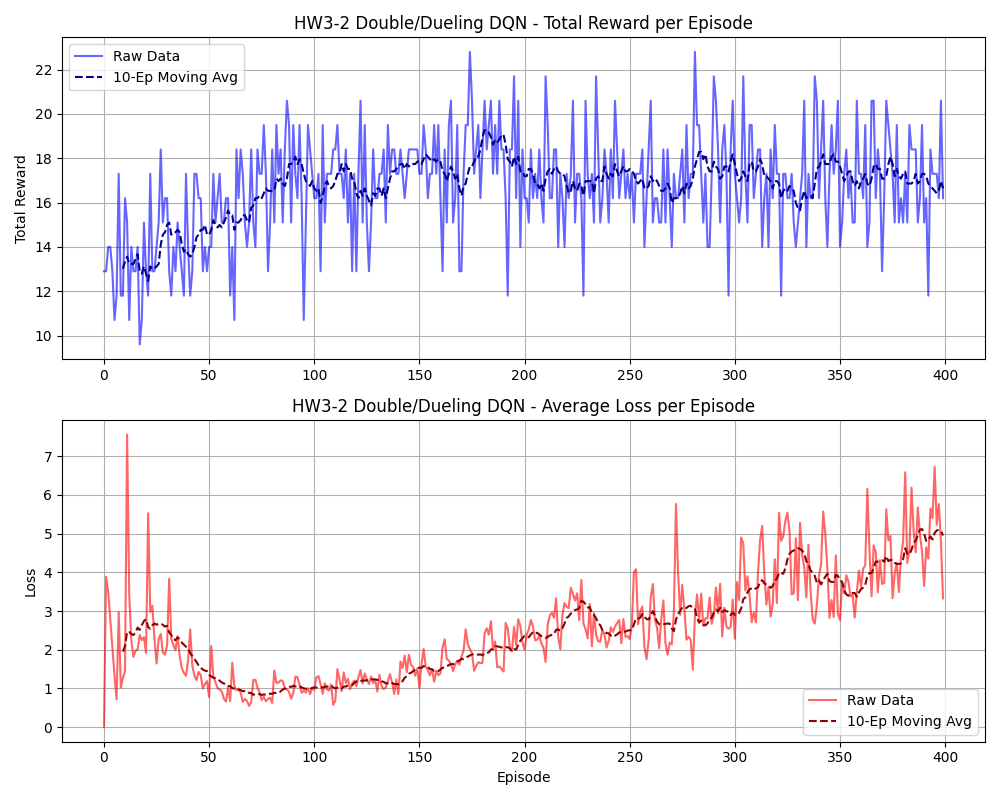
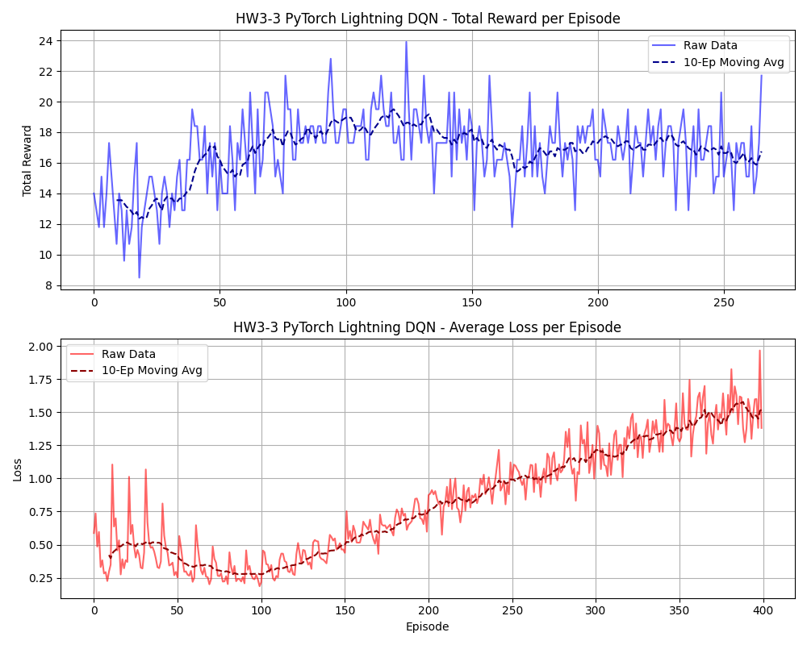
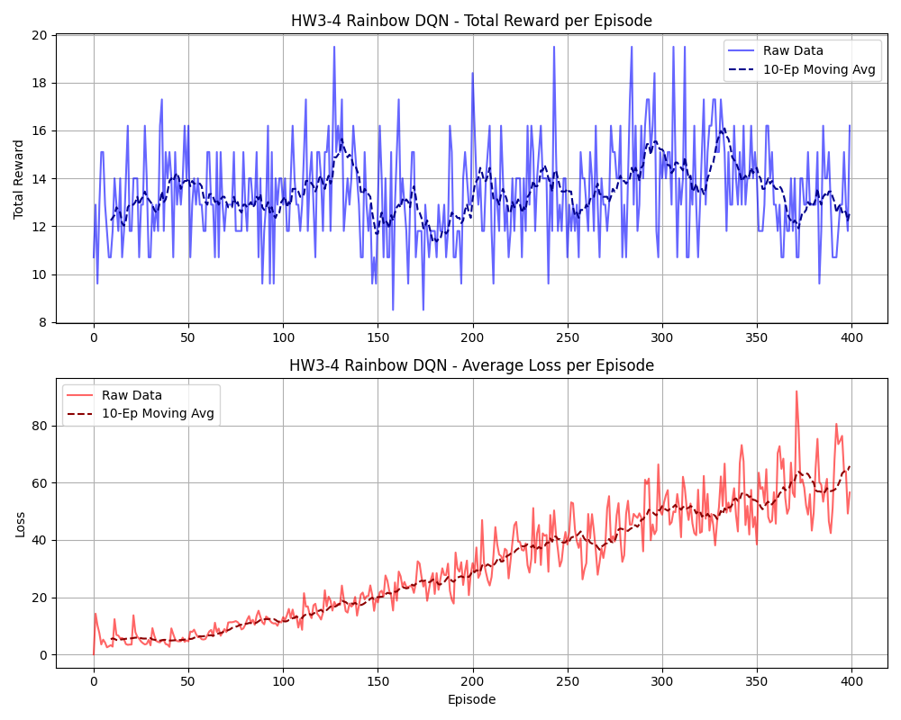

# Updated GridWorld Results & Trajectories

根據您的要求，我為您產生了帶有「連續箭頭 ($S \rightarrow \rightarrow \rightarrow G$)」的靜態路徑圖，並且重繪了所有的 Loss & Reward 圖表！

## 1. Static Continuous Trajectories
這 6 張圖完美展示了 Agent 學習到的最短路徑。箭頭從起點 `S` (Start) 出發，繞過紅色的 `Pit` 與黑色的 `W` (Wall)，成功走到綠色的 `Goal`！

### Player Mode (固定地圖，隨機起點)
````carousel

<!-- slide -->

<!-- slide -->

````

### Random Mode (全盤隨機)
每次都會生出完全不一樣的迷宮，但 Agent 依然能精準導航！
````carousel

<!-- slide -->

<!-- slide -->

````

---

## 2. Updated Training Metrics (Loss & Reward)
我拉長了訓練回合 (Episodes: 400)，並在圖表中加入了**Legend (圖例)**。
- 淺藍色/淺紅色：每個 Episode 的原始資料 (`Raw Data`)
- 深藍色/深紅色：10 回合的移動平均線 (`10-Ep Moving Avg`)，讓趨勢更清晰！

### 為什麼 Loss 一開始會上升？
你可能會注意到 Loss 不是一路往下的，有時甚至在發現終點後發生飆升！
這是因為 **DQN 的 Target 是會移動的 (Moving Target)**：
1. **初期**：Agent 亂走，網路預測 Q 值是 0，現實得分也是 0，所以 $Loss \approx 0$。
2. **中期**：Agent 發現終點拿到 $+10$ 獎勵。此時真實 Target 瞬間飆到 10，但神經網路對這個狀態的預測還是 0，因此 $Loss$ 產生巨大的 Spike！
3. **後期**：當神經網路把所有的 Q 值都調整完畢後，Loss 才會真正下降收斂。
這也是為什麼加入 Target Network (HW3-2) 能夠大幅平滑這種類型的劇烈震盪！

````carousel

<!-- slide -->

<!-- slide -->

<!-- slide -->

````
