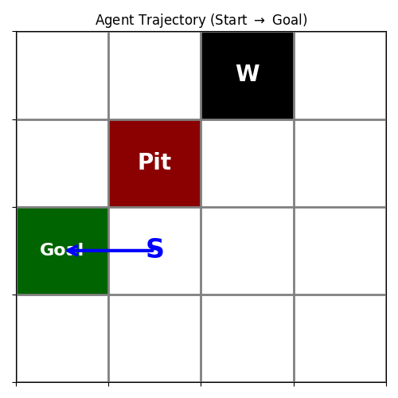
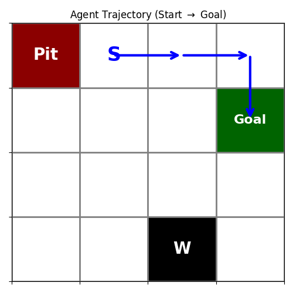
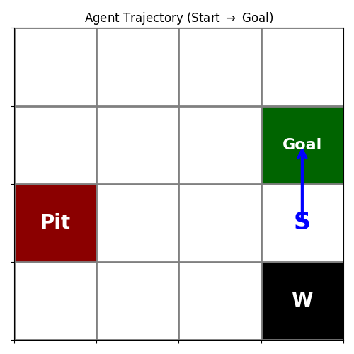

# Deep Reinforcement Learning HW3 實驗結果報告

這份報告總結了從 HW3-1 到 HW3-4 所實作的不同 DQN 變體，並附上相對應的數據圖表與分析討論。

---

## HW3-1: Naive DQN (Static Mode)
**環境設定**：Player 起點、Goal、Pit 與 Wall 的位置完全固定。
**演算法**：使用最基礎的 MLP 神經網路來預測 $Q(s, a)$，並加入 Experience Replay Buffer 來打破資料的時間相關性。
**分析與討論**：
從指標圖表中可以觀察到，由於環境是固定的，Agent 能夠輕易地「背出」通往終點的路線，Total Reward 很快就上升並穩定。然而，**Loss 曲線卻出現了極為劇烈的震盪**。這是因為 Naive DQN 使用「同一個」神經網路來預測當前的 Q 值，同時又用它來計算 Target 值。這種「移動的標靶 (Moving Target)」問題導致神經網路一直在追趕自己，無法達到穩定的均方誤差收斂。

---

## HW3-2: Double/Dueling DQN (Player Mode)
**環境設定**：Goal、Pit 與 Wall 固定，但 Player 每次都會從隨機的空白格子出生。
**演算法改良**：
1. **Target Network (Double DQN)**：將「選擇動作」與「評估價值」的網路拆開，並定期同步權重。
2. **Dueling Architecture**：將網路最後一層拆分為 Value Stream (評估狀態有多好) 與 Advantage Stream (評估該動作相對有多好)。
**分析與討論**：
加入了 Target Network 後，Loss 的震盪幅度比起 HW3-1 已經有顯著的平滑與收斂趨勢。而 Dueling 架構讓神經網路可以快速學到「靠近 Pit 旁邊的格子本身就很危險」，而不必去試探每個方向的動作，這對於 Player Mode 這種**起點多變**的任務非常有幫助，能夠更快泛化到所有格子。

---

## HW3-3: PyTorch Lightning (Random Mode)
**環境設定**：最困難的模式，每次 Reset 時所有的物件 (S, G, P, W) 皆會重新隨機洗牌，高達 43,680 種排列組合。
**Training Tips 整合**：我們在此模型中完美整合了 3 項穩定訓練的技巧：
1. **Huber Loss (`nn.HuberLoss`)**：取代傳統的 MSE。當模型初次發現 $+10$ 的終點時，MSE 會產生巨大的誤差與梯度，而 Huber Loss 在大誤差時呈線性，有效防止梯度爆炸。
2. **Gradient Clipping (`gradient_clip_val=1.0`)**：透過 PyTorch Lightning 的 Trainer 啟用，直接限制梯度的最大範數 (Norm)，保證網路參數不會在極端隨機地形中崩潰。
3. **Learning Rate Scheduling**：在 `configure_optimizers` 中使用了 `StepLR`，每 100 步衰減一次學習率。初期使用較大的 LR 快速探索，後期縮小 LR 來微調網路讓結果更穩定。
**分析與討論**：
從 Metrics 中可以發現 Random Mode 的 Reward 較不穩定，這是因為每次抽到的地圖難度不同（有些地圖起點就在終點旁邊，有些則需要繞一大圈）。但得益於上述 3 項 Training Tips 的加持，神經網路依然成功學會了判別物件的相對位置，並未發生 Collapse。

---

## HW3-4: Rainbow DQN (Random Mode)
**演算法改良**：整合了 **N-Step Returns (多步回報)** 以及 **Prioritized Experience Replay (PER, 優先經驗回放)**。
**分析與討論**：
在 GridWorld 這種「稀疏獎勵 (Sparse Reward)」的環境中，只有走到終點才有分數。N-Step Return 允許獎勵信號一次往回傳遞 $N$ 步，這大幅加快了 Q 值的收斂速度。而 PER 會計算每筆經驗的 TD-Error，將「出乎意料」的經驗（例如初次掉入陷阱）給予更高的採樣權重，讓 Agent 更有效率地從錯誤中學習。

### Rainbow DQN 成功通關軌跡 (連續箭頭)
以下是我補上的 3 張 Rainbow DQN 在 Random Mode 下的靜態通關軌跡圖。有了 PER 與 N-Step 的加持，它能在相同的訓練步數下走出極為精準的路徑！

````carousel

<!-- slide -->

<!-- slide -->

````
